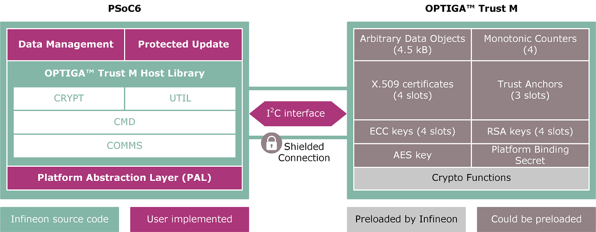
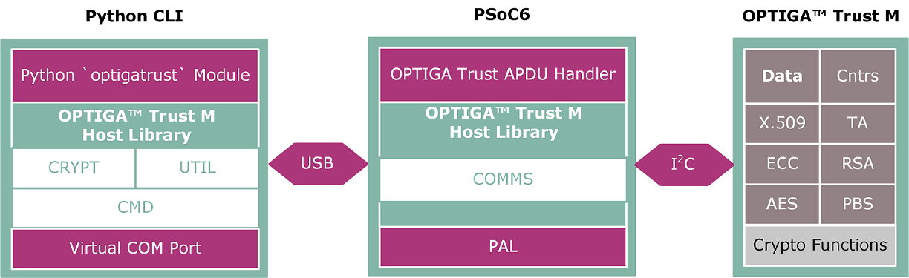

# OPTIGA&trade; Trust M: Data and certificates management

This example demonstrates how you can manage data and certificates on a OPTIGA&trade; Trust M V3 security solution using a PSoC&trade; 6 MCU as a bridge. This example has the following two setups:

- **Example mode:** Figure 1 shows a generic example demonstrated as part of the ModusToolbox&trade; project showing direct API calls such as `optiga_util_read_data`, `optiga_util_write_data`, and `optiga_util_protected_update` to read, write, and securely update the data on the OPTIGA&trade; Trust M device.

- **Provisioning mode:** Figure 2 shows a special example, where the `optigatrust` Python module can be used to directly access the device and manipulate internal settings. In this case, the host MCU is turned into a bridge to allow Python commands reach the security solution so that the communication occurs in the following sequence:

   **Python Script <-> USB <-> PSoC&trade; 6 MCU <-> I2C <-> OPTIGA&trade; Trust M**

**Figure 1. Example mode**



<br>

**Figure 2. Provisioning mode**




[View this README on GitHub.](https://github.com/Infineon/mtb-example-optiga-data-management)

[Provide feedback on this code example.](https://cypress.co1.qualtrics.com/jfe/form/SV_1NTns53sK2yiljn?Q_EED=eyJVbmlxdWUgRG9jIElkIjoiQ0UyMzM3MzUiLCJTcGVjIE51bWJlciI6IjAwMi0zMzczNSIsIkRvYyBUaXRsZSI6Ik9QVElHQSZ0cmFkZTsgVHJ1c3QgTTogRGF0YSBhbmQgY2VydGlmaWNhdGVzIG1hbmFnZW1lbnQiLCJyaWQiOiJ5dXNoZXYiLCJEb2MgdmVyc2lvbiI6IjIuMS4wIiwiRG9jIExhbmd1YWdlIjoiRW5nbGlzaCIsIkRvYyBEaXZpc2lvbiI6Ik4vQSIsIkRvYyBCVSI6Ik4vQSIsIkRvYyBGYW1pbHkiOiJOL0EifQ==)

## Requirements

- [ModusToolbox&trade; software](https://www.infineon.com/modustoolbox) v3.1 or later (tested with v3.1)
- Board support package (BSP) minimum required version: 4.0.0
- Programming language: C

- Associated parts:
   - All [PSoC&trade; 6 MCU](https://www.infineon.com/PSoC6) parts with SDIO
   - [OPTIGA&trade; Trust M security solution](https://www.infineon.com/cms/de/product/security-smart-card-solutions/optiga-embedded-security-solutions/optiga-trust/optiga-trust-m-sls32aia/)


## Supported toolchains (make variable 'TOOLCHAIN')

- GNU Arm&reg; embedded compiler v11.3.1 (`GCC_ARM`) - Default value of `TOOLCHAIN`
- Arm&reg; compiler v6.16 (`ARM`)
- IAR C/C++ compiler v9.30.1 (`IAR`)


## Supported kits (make variable 'TARGET')

- [OPTIGA&trade; Trust IoT security development kit](https://www.infineon.com/cms/en/product/evaluation-boards/optiga-trust-m-iot-kit/) (`CYSBSYSKIT-DEV-01`) – Default value of `TARGET`
- [PSoC&trade; 62S2 evaluation kit](https://www.infineon.com/CY8CEVAL-062S2) (`CY8CEVAL-062S2`, `CY8CEVAL-062S2-LAI-43439M2`, `CY8CEVAL-062S2-LAI-4373M2`, `CY8CEVAL-062S2-MUR-43439M2`, `CY8CEVAL-062S2-MUR-4373EM2`)

## Hardware setup

This example uses the board's default configuration. See the kit user guide to ensure that the board is configured correctly.

## Software setup

- **Example mode:** Install a terminal emulator if you don't have one. Instructions in this document use [Tera Term](https://ttssh2.osdn.jp/index.html.en).

- **Provisioning mode:** Do the following:
   1. Install an `optigatrust` Python module.

   2. Open the `modus-shell` tool (locally available at *{ModusToolbox&trade; install directory}/tools_2.X)*.

   3. In the terminal emulator, execute the following command:

       ```
       pip install optigatrust
       ```

## Using the code example

Create the project and open it using one of the following:

<details><summary><b>In Eclipse IDE for ModusToolbox&trade; software</b></summary>

1. Click the **New Application** link in the **Quick Panel** (or, use **File** > **New** > **ModusToolbox&trade; Application**). This launches the [Project Creator](https://www.infineon.com/ModusToolboxProjectCreator) tool.

2. Pick a kit supported by the code example from the list shown in the **Project Creator - Choose Board Support Package (BSP)** dialog.

   When you select a supported kit, the example is reconfigured automatically to work with the kit. To work with a different supported kit later, use the [Library Manager](https://www.infineon.com/ModusToolboxLibraryManager) to choose the BSP for the supported kit. You can use the Library Manager to select or update the BSP and firmware libraries used in this application. To access the Library Manager, click the link from the **Quick Panel**.

   You can also just start the application creation process again and select a different kit.

   If you want to use the application for a kit not listed here, you may need to update the source files. If the kit does not have the required resources, the application may not work.

3. In the **Project Creator - Select Application** dialog, choose the example by enabling the checkbox.

4. (Optional) Change the suggested **New Application Name**.

5. The **Application(s) Root Path** defaults to the Eclipse workspace which is usually the desired location for the application. If you want to store the application in a different location, you can change the *Application(s) Root Path* value. Applications that share libraries should be in the same root path.

6. Click **Create** to complete the application creation process.

For more details, see the [Eclipse IDE for ModusToolbox&trade; software user guide](https://www.infineon.com/MTBEclipseIDEUserGuide) (locally available at *{ModusToolbox&trade; software install directory}/ide_{version}/docs/mt_ide_user_guide.pdf*).

</details>

<details><summary><b>In command-line interface (CLI)</b></summary>

ModusToolbox&trade; software provides the Project Creator as both a GUI tool and the command line tool, "project-creator-cli". The CLI tool can be used to create applications from a CLI terminal or from within batch files or shell scripts. This tool is available in the *{ModusToolbox&trade; software install directory}/tools_{version}/project-creator/* directory.

Use a CLI terminal to invoke the "project-creator-cli" tool. On Windows, use the command line "modus-shell" program provided in the ModusToolbox&trade; software installation instead of a standard Windows command-line application. This shell provides access to all ModusToolbox&trade; software tools. You can access it by typing `modus-shell` in the search box in the Windows menu. In Linux and macOS, you can use any terminal application.

The "project-creator-cli" tool has the following arguments:

Argument | Description | Required/optional
---------|-------------|-----------
`--board-id` | Defined in the `<id>` field of the [BSP](https://github.com/Infineon?q=bsp-manifest&type=&language=&sort=) manifest | Required
`--app-id`   | Defined in the `<id>` field of the [CE](https://github.com/Infineon?q=ce-manifest&type=&language=&sort=) manifest | Required
`--target-dir`| Specify the directory in which the application is to be created if you prefer not to use the default current working directory | Optional
`--user-app-name`| Specify the name of the application if you prefer to have a name other than the example's default name | Optional

<br>

The following example clones the "[Hello world](https://github.com/Infineon/mtb-example-psoc6-hello-world)" application with the desired name "MyHelloWorld" configured for the *CYSBSYSKIT-DEV-01* BSP into the specified working directory, *C:/mtb_projects*:

   ```
   project-creator-cli --board-id CYSBSYSKIT-DEV-01 --app-id mtb-example-psoc6-hello-world --user-app-name MyHelloWorld --target-dir "C:/mtb_projects"
   ```

**Note:** The project-creator-cli tool uses the `git clone` and `make getlibs` commands to fetch the repository and import the required libraries. For details, see the "Project creator tools" section of the [ModusToolbox&trade; software user guide](https://www.infineon.com/ModusToolboxUserGuide) (locally available at *{ModusToolbox&trade; software install directory}/docs_{version}/mtb_user_guide.pdf*).

</details>

<details><summary><b>In third-party IDEs</b></summary>

Use one of the following options:

- **Use the standalone [Project Creator](https://www.infineon.com/ModusToolboxProjectCreator) tool:**

   1. Launch Project Creator from the Windows Start menu or from *{ModusToolbox&trade; software install directory}/tools_{version}/project-creator/project-creator.exe*.

   2. In the initial **Choose Board Support Package** screen, select the BSP, and click **Next**.

   3. In the **Select Application** screen, select the appropriate IDE from the **Target IDE** drop-down menu.

   4. Click **Create** and follow the instructions printed in the bottom pane to import or open the exported project in the respective IDE.

<br>

- **Use command-line interface (CLI):**

   1. Follow the instructions from the **In command-line interface (CLI)** section to create the application, and then import the libraries using the `make getlibs` command.

   2. Export the application to a supported IDE using the `make <ide>` command.

   3. Follow the instructions displayed in the terminal to create or import the application as an IDE project.

For a list of supported IDEs and more details, see the "Exporting to IDEs" section of the [ModusToolbox&trade; software user guide](https://www.infineon.com/ModusToolboxUserGuide) (locally available at *{ModusToolbox&trade; software install directory}/docs_{version}/mtb_user_guide.pdf*).

</details>


## Operation

Depending on the configuration, use either [Example mode](#example-mode) or [Provisioning mode](#provisioning-mode).


### Example mode

The examples are presented in the form of various API calls.

1. Connect the board to your PC using the provided USB cable through the KitProg3 USB connector.

2. Open a terminal program and select the KitProg3 COM port. Set the serial port parameters to 8N1 and 115200 baud.

3. Open the *Makefile* in any text editor, find the line `PROVISIONING_MODE` and change the value from '1' to '0', and then save the change.

    ```c
    # Define whether the example should be compiled in provisioning mode
    PROVISIONING_MODE=0
    ```

4. Program the board.

   - **Using Eclipse IDE for ModusToolbox&trade;:**

      1. Select the application project in the Project Explorer.

      2. In the **Quick Panel**, scroll down, and click **\<Application Name> Program (KitProg3_MiniProg4)**.

   - **Using CLI:**

     From the terminal, execute the `make program` command to build and program the application using the default toolchain to the default target. You can specify a target and toolchain manually:
      ```
      make program TARGET=<BSP> TOOLCHAIN=<toolchain>
      ```

      Example:
      ```
      make program TARGET=CYSBSYSKIT-DEV-01 TOOLCHAIN=GCC_ARM
      ```

5. After programming, connect the serial terminal and see the output there.


### Provisioning mode

1. Connect the board to your PC using the provided USB cable through the KitProg3 USB connector.

2. Open the *Makefile* in any text editor, find the line `PROVISIONING_MODE` and change the value from '0' to '1', and then save the change.

    ```c
    # Define whether the example should be compiled in provisioning mode
    PROVISIONING_MODE=1
    ```

3. Program the board.

   - **Using Eclipse IDE for ModusToolbox&trade;:**

      1. Select the application project in the Project Explorer.

      2. In the **Quick Panel**, scroll down, and click **\<Application Name> Program (KitProg3_MiniProg4)**.

   - **Using CLI:**

     From the terminal, execute the `make program` command to build and program the application using the default toolchain to the default target. You can specify a target and toolchain manually:
      ```
      make program TARGET=<BSP> TOOLCHAIN=<toolchain>
      ```

      Example:
      ```
      make program TARGET=CYSBSYSKIT-DEV-01 TOOLCHAIN=GCC_ARM
      ```

4. After programming, unplug the board from the USB port and reconnect it again. Make sure that all serial communication to that port (for example, working Tera Term sessions) are closed.

5. Open the `modus-shell` tool again as described in the [Software setup](#software-setup) section.

6. To try out the connection with the security solution, execute the following command:
   ```
   optigatrust object --id 0xe0e0 --outform PEM
   ```

   **Note: if you see a message like the one below, try to repeat the command, as sometimes the stadard output/inout isn't cleaned and some rest information stays**
   
   ```
   $ optigatrust object --id 0xe0e0
   No Start Sequence found
   Error: 0x202
   Could not find module 'C:\Users\user\ModusToolbox\tools_3.0\python\lib\site-packages\optigatrust\csrc\lib\liboptigatrust-i2c-win-amd64.dll' (or one of its dependencies). Try using the full path with constructor syntax.
   libusb: Failed to connect
   uart: Failed to connect
   i2c: Failed to find library liboptigatrust-i2c-win-amd64.dll in C:\Users\user\ModusToolbox\tools_3.0\python\lib\site-packages\optigatrust\csrc\lib
   ```
   
7. To see the metadata associated with that object, execute the following command:
   ```
   optigatrust object --id 0xe0e0 --meta
   ```

For more examples, see the [*optigatrust* command line interface](#optigatrust-command-line-interface) section.

To use the command-line interface to inject/import custom credentials you can follow [this](ImportCustomCredentials.md) guidance.


## Debugging

You can debug the example to step through the code. In the IDE, use the **\<Application Name> Debug (KitProg3_MiniProg4)** configuration in the **Quick Panel**. For details, see the "Program and debug" section in the [Eclipse IDE for ModusToolbox&trade; software user guide](https://www.infineon.com/MTBEclipseIDEUserGuide).

**Note:** **(Only while debugging)** On the CM4 CPU, some code in `main()` may execute before the debugger halts at the beginning of `main()`. This means that some code executes twice – once before the debugger stops execution, and again after the debugger resets the program counter to the beginning of `main()`. See [KBA231071](https://community.infineon.com/docs/DOC-21143) to learn about this and for the workaround.


## Design and implementation

### Provisioning mode design

The general idea is to link the `optigatrust` Python module and an OPTIGA&trade; Trust M security solution through I2C. For this, the PSoC&trade; 6 board is flashed with a dedicated firmware, which turns it into a bridge device translating the commands from the Python library to the security solution. In this case, the setup looks similar to the following sequence:

 **optigatrust Python modules <-> USB (UART) <-> PSoC&trade; 6 MCU <-> I2C <-> OPTIGA&trade; Trust M**

The firmware implements a very rudimentary finite state machine (the *provisioning_sm.c* file) with the following four states:

- `INIT_STATE` – Initialization state to open the Infineon I2C protocol with the security solution. Afterwards, a transition into the `RX_STATE` is triggered.
- `RX_STATE` – A state in which the host (PSoC&trade; 6 MCU) is waiting for a start sequence over the UART interface:
    ```
    uint8_t start_seq[] = {0xbe, 0xef, 0xde, 0xad}`)
    ```
    Afterwards, the APDU from the Python script is forwarded over the Infineon I2C protocol to the OPTIGA&trade; Trust chip, at the same time expecting an answer either from the security solution or an error code. Afterwards, a transition into the `TX_STATE` is triggered.
- `TX_STATE` – A state which prepares the answer from the OPTIGA&trade; Trust M to send over the UART interface back to the host system. Afterwards, the state is again in `RX_STATE`.
- `ERROR_STATE`


### Example mode design

The main file executes several sub-examples:

- Read out the data from the OPTIGA&trade; Trust M using `example_optiga_util_read_data()`
- Write data to the OPTIGA&trade; Trust M using `example_optiga_util_write_data()`
- Demonstrate how to work with build-in counters using `example_optiga_util_update_count()`
- Run a protected update routine for key objects, data objects, and metadata associated with the objects/keys using `example_optiga_util_protected_update()`. For more information, see [How to run a custom protected data/key/metadata update](#ImportCustomCredentials.md).
- Read the coprocessor unique ID using `example_read_coprocessor_id()`. This is a demonstration of the `optiga_util_read_data()` function call using a coprocessor unique ID object.


### *optigatrust* command-line interface

| Command            | Note                |
| ------------------ | -------------------- |
| `optigatrust object --help` | Displays the usage information for the command `object`|
| `optigatrust object --id 0xe0e0` | Read the content of the object 0xe0e0 (to get the [objects map](https://infineon.github.io/python-optiga-trust/metadata.html)) |
| `optigatrust object --id 0xe0e0 --out certificate.pem --outform PEM` | Read the content of the object 0xe0e0, try to convert it into a PEM-formatted X.509 certificate, and store the result into a *certificate.pem* text file |
| `optigatrust object --id 0xe0e0 --meta` | Read the metadata of the object 0xe0e0 |
| `optigatrust object --in data_metadata.json` | Write to the OPTIGA&trade; Trust data and metadata from JSON format  |
| `optigatrust object --export-otc` | Read all the objects from the OPTIGA&trade; Trust and store them into a format compatible with OPTIGA&trade; Trust configurator |
| `optigatrust object --export-json` | Read all objects from the OPTIGA&trade; Trust and store them into JSON format* |
| `optigatrust create-keys --help` | Displays the usage information for the command `create-keys`  |
| `optigatrust create-keys --id 0xe0f1` | Generate an ECC NISTP256 public/private key-pair and store the private component in the given key [object ID](https://infineon.github.io/python-optiga-trust/metadata.html). Private key usage is set to *signature* by default.  |
| `optigatrust create-keys --id 0xe0f1 --pubout public.pkey --privout private.key` | Generate an ECC NISTP256 public/private key-pair and store them in the corresponding files. The output is PEM-formatted.    |
| `optigatrust create-keys --id 0xe0f1 --curve secp384r1` | Generate an ECC NISTP384 public/private key-pair |
| `optigatrust create-keys --id 0xe0f1 --key-usage key_agreement --key-usage signature` | Generate an ECC NISTP256 public/private key-pair and put the private key usage to be *KeyAgreement* and *Signature* |
| `optigatrust create-keys --id 0xe0fc --rsa --key_size 2048` | Generate an RSA public/private key-pair with a key size of 2048 bits. Private key usage is set to *Signature* by default. |

For other commands, see the [`python-optiga-trust`](https://github.com/Infineon/python-optiga-trust) repository.

To use the command-line interface to inject/import custom credentials you can follow [this](ImportCustomCredentials.md) guidance.

<br>

<details><summary><b>The format of the `data_metadata.json` can look like the following:</b></summary>


```json
{
    "e0e1":
    {
        "pretty_metadata":
        {
            "change": ['int','0xe0','0xe9','&&','conf','0xe2','0x00'],
        }
    },
    "e0f1":
    {
        "pretty_metadata":
        {
            "change": ['int','0xe0','0xe9','&&','conf','0xe2','0x00'],
        }
    }
}

```

</details>

<br>

## Related resources


Resources | Links
----------|------
Application notes |[AN228571](https://www.infineon.com/dgdl/Infineon-AN228571_Getting_started_with_PSoC_6_MCU_on_ModusToolbox_software-ApplicationNotes-v06_00-EN.pdf?fileId=8ac78c8c7cdc391c017d0d36de1f66d1) – Getting started with PSoC&trade; 6 MCU on ModusToolbox&trade; software <br> [AN215656](https://www.infineon.com/dgdl/Infineon-AN215656_PSoC_6_MCU_Dual-CPU_System_Design-ApplicationNotes-v09_00-EN.pdf?fileId=8ac78c8c7cdc391c017d0d3180c4655f) – PSoC&trade; 6 MCU: Dual-CPU system design
Code examples on GitHub| [Using ModusToolbox&trade; software](https://github.com/Infineon/Code-Examples-for-ModusToolbox-Software)
Device documentation | [PSoC&trade; 6 MCU datasheets](https://www.infineon.com/dgdl/Infineon-PSoC_6_MCU_CY8C62x6_CY8C62x7-DataSheet-v14_00-EN.pdf?fileId=8ac78c8c7d0d8da4017d0ee4c9386bff) <br> [PSoC&trade; 6 technical reference manuals](https://www.infineon.com/dgdl/Infineon-PSoC_6_MCU_PSoC_62_Architecture_Technical_Reference_Manual-AdditionalTechnicalInformation-v08_00-EN.pdf?fileId=8ac78c8c7d0d8da4017d0f94758401d1) <br> [OPTIGA&trade; Trust M datasheet](https://www.infineon.com/cms/en/product/security-smart-card-solutions/optiga-embedded-security-solutions/optiga-trust/optiga-trust-m-sls32aia/#!?fileId=5546d4626c1f3dc3016c853c271a7e4a)
Development kits | Select your kits from the [Evaluation Board Finder](https://www.infineon.com/cms/en/design-support/finder-selection-tools/product-finder/evaluation-board) page.
Libraries on GitHub  | [mtb-pdl-cat1](https://github.com/Infineon/mtb-pdl-cat1) – PSoC&trade; 6 peripheral driver library (PDL)  <br> [mtb-hal-cat1](https://github.com/Infineon/mtb-hal-cat1) – Hardware abstraction layer (HAL) library <br> [retarget-io](https://github.com/Infineon/retarget-io) – Utility library to retarget STDIO messages to a UART port
Middleware on GitHub  | [optiga-trust-m](https://github.com/Infineon/optiga-trust-m) – OPTIGA&trade; Trust M library and documents <br> [capsense](https://github.com/Infineon/capsense) – CAPSENSE&trade; library and documents <br> [psoc6-middleware](https://github.com/Infineon/modustoolbox-software#psoc-6-middleware-libraries) – Links to all PSoC&trade; 6 MCU middleware
Tools  | [Eclipse IDE for ModusToolbox&trade; software](https://www.infineon.com/cms/en/design-support/tools/sdk/modustoolbox-software) – ModusToolbox&trade; software is a collection of easy-to-use software and tools enabling rapid development with Infineon MCUs, covering applications from embedded sense and control to wireless and cloud-connected systems using AIROC&trade; Wi-Fi and Bluetooth® connectivity devices.

## Other resources

Infineon provides a wealth of data at www.infineon.com to help you select the right device, and quickly and effectively integrate it into your design.

For PSoC&trade; 6 MCU devices, see [How to design with PSoC&trade; 6 MCU – KBA223067](https://community.infineon.com/t5/Knowledge-Base-Articles/How-to-Design-with-PSoC-6-MCU-KBA223067/ta-p/248857) in the Infineon Developer Community.


## Document history

Document title: *CE233735* – *OPTIGA&trade; Trust M: Data and certificates management*

| Version | Description of change |
| ------- | --------------------- |
| 1.0.0   | New code example      |
| 2.0.0   | use the latest optiga-trust-m middleware release |
| 2.1.0   | Added support for new kits |


All other trademarks or registered trademarks referenced herein are the property of their respective owners.

-----------------

© Cypress Semiconductor Corporation, 2023. This document is the property of Cypress Semiconductor Corporation, an Infineon Technologies company, and its affiliates ("Cypress").  This document, including any software or firmware included or referenced in this document ("Software"), is owned by Cypress under the intellectual property laws and treaties of the United States and other countries worldwide.  Cypress reserves all rights under such laws and treaties and does not, except as specifically stated in this paragraph, grant any license under its patents, copyrights, trademarks, or other intellectual property rights.  If the Software is not accompanied by a license agreement and you do not otherwise have a written agreement with Cypress governing the use of the Software, then Cypress hereby grants you a personal, non-exclusive, nontransferable license (without the right to sublicense) (1) under its copyright rights in the Software (a) for Software provided in source code form, to modify and reproduce the Software solely for use with Cypress hardware products, only internally within your organization, and (b) to distribute the Software in binary code form externally to end users (either directly or indirectly through resellers and distributors), solely for use on Cypress hardware product units, and (2) under those claims of Cypress’s patents that are infringed by the Software (as provided by Cypress, unmodified) to make, use, distribute, and import the Software solely for use with Cypress hardware products.  Any other use, reproduction, modification, translation, or compilation of the Software is prohibited.
<br>
TO THE EXTENT PERMITTED BY APPLICABLE LAW, CYPRESS MAKES NO WARRANTY OF ANY KIND, EXPRESS OR IMPLIED, WITH REGARD TO THIS DOCUMENT OR ANY SOFTWARE OR ACCOMPANYING HARDWARE, INCLUDING, BUT NOT LIMITED TO, THE IMPLIED WARRANTIES OF MERCHANTABILITY AND FITNESS FOR A PARTICULAR PURPOSE.  No computing device can be absolutely secure.  Therefore, despite security measures implemented in Cypress hardware or software products, Cypress shall have no liability arising out of any security breach, such as unauthorized access to or use of a Cypress product.  CYPRESS DOES NOT REPRESENT, WARRANT, OR GUARANTEE THAT CYPRESS PRODUCTS, OR SYSTEMS CREATED USING CYPRESS PRODUCTS, WILL BE FREE FROM CORRUPTION, ATTACK, VIRUSES, INTERFERENCE, HACKING, DATA LOSS OR THEFT, OR OTHER SECURITY INTRUSION (collectively, "Security Breach").  Cypress disclaims any liability relating to any Security Breach, and you shall and hereby do release Cypress from any claim, damage, or other liability arising from any Security Breach.  In addition, the products described in these materials may contain design defects or errors known as errata which may cause the product to deviate from published specifications.  To the extent permitted by applicable law, Cypress reserves the right to make changes to this document without further notice. Cypress does not assume any liability arising out of the application or use of any product or circuit described in this document.  Any information provided in this document, including any sample design information or programming code, is provided only for reference purposes.  It is the responsibility of the user of this document to properly design, program, and test the functionality and safety of any application made of this information and any resulting product.  "High-Risk Device" means any device or system whose failure could cause personal injury, death, or property damage.  Examples of High-Risk Devices are weapons, nuclear installations, surgical implants, and other medical devices.  "Critical Component" means any component of a High-Risk Device whose failure to perform can be reasonably expected to cause, directly or indirectly, the failure of the High-Risk Device, or to affect its safety or effectiveness.  Cypress is not liable, in whole or in part, and you shall and hereby do release Cypress from any claim, damage, or other liability arising from any use of a Cypress product as a Critical Component in a High-Risk Device.  You shall indemnify and hold Cypress, including its affiliates, and its directors, officers, employees, agents, distributors, and assigns harmless from and against all claims, costs, damages, and expenses, arising out of any claim, including claims for product liability, personal injury or death, or property damage arising from any use of a Cypress product as a Critical Component in a High-Risk Device.  Cypress products are not intended or authorized for use as a Critical Component in any High-Risk Device except to the limited extent that (i) Cypress’s published data sheet for the product explicitly states Cypress has qualified the product for use in a specific High-Risk Device, or (ii) Cypress has given you advance written authorization to use the product as a Critical Component in the specific High-Risk Device and you have signed a separate indemnification agreement.
<br>
Cypress, the Cypress logo, and combinations thereof, WICED, ModusToolBox, PSoC, CapSense, EZ-USB, F-RAM, and Traveo are trademarks or registered trademarks of Cypress or a subsidiary of Cypress in the United States or in other countries.  For a more complete list of Cypress trademarks, visit cypress.com.  Other names and brands may be claimed as property of their respective owners.

-------------------------------------------------------------------------------
